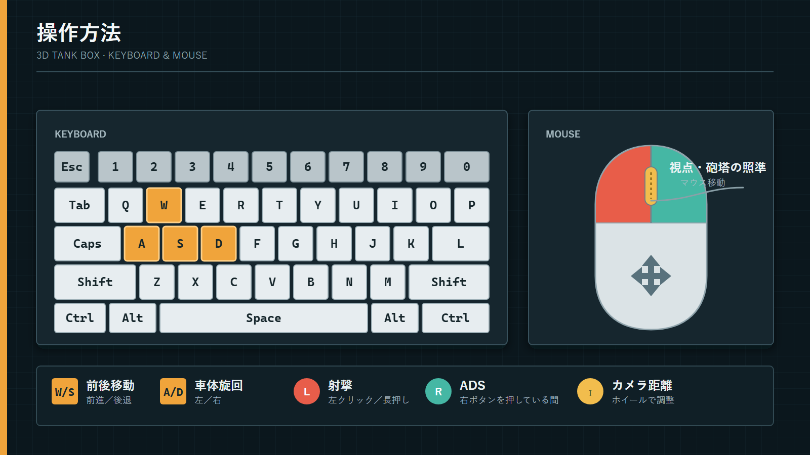

# 3D Tank Box

C++とDirectX 11を使用し、既製ゲームエンジンを使用せずに制作した三人称視点の3D戦車アクションゲームです。入社時研修の一環として、プログラマー4名で約1.5か月間開発しました。

## 開発環境

- C++ / HLSL
- Win32 / DirectX 11 / DirectInput
- FreeType / FMOD
- Visual Studio 2022（Platform Toolset v143）

Solution：[`Project/3D_Tank/3D_Tank.sln`](Project/3D_Tank/3D_Tank.sln)

## 実行用ビルド

コンパイルせずに動作を確認できるWindows x64向けビルドを、[`Game`](Game)ディレクトリに収録しています。配布データは分割ZIP形式で、ダウンロードサイズは合計約0.31 GB、展開後は約0.89 GBです。

### 実行手順

1. `Game`ディレクトリ内の`Release.zip`と`Release.z01`～`Release.z13`を、すべて同じディレクトリへダウンロードします。
2. 7-Zipなど分割ZIPに対応したソフトウェアで[`Release.zip`](Game/Release.zip)を開き、展開します。`.z01`～`.z13`は分割データのため、個別には展開しません。
3. 展開された`Release`ディレクトリ内の`3D_Tank.exe`を実行します。

`Resource`ディレクトリ、Shaderファイル、`fmod.dll`、`fmodL.dll`、`freetype.dll`は実行に必要です。展開後も`3D_Tank.exe`と同じディレクトリ構成のまま使用してください。

### 動作環境

| 項目 | 内容 |
| --- | --- |
| OS | Windows 10 / 11（64-bit） |
| GPU | DirectX 11に対応したGPU |
| 入力機器 | キーボード、マウス |
| ストレージ | 1.5 GB以上の空き容量を推奨（圧縮データと展開後データを含む） |
| 追加ランタイム | FMODおよびFreeTypeの必要なDLLは配布データに同梱 |

## 主なコード

コードレビュー時は、以下の順序で確認すると、アプリケーションの実行基盤からGameplayまでの構成を追うことができます。

| 領域 | 主な内容 | 代表ファイル |
| --- | --- | --- |
| メインループ | アプリケーションの初期化、更新、描画 | [`Engine.cpp`](Project/3D_Tank/3D_Tank/Engine.cpp) |
| オブジェクト／コンポーネント | GameObject、Component、Transform階層、Scene管理 | [`GameObject`](Project/3D_Tank/3D_Tank/GameObject.cpp) / [`Component`](Project/3D_Tank/3D_Tank/Component.cpp) / [`Transform`](Project/3D_Tank/3D_Tank/Transform.cpp) / [`SceneManager`](Project/3D_Tank/3D_Tank/SceneManager.cpp) |
| DirectX 11基盤 | Device、SwapChain、Render Targetおよび描画処理 | [`Graphics`](Project/3D_Tank/3D_Tank/Graphics.cpp) / [`Rendering`](Project/3D_Tank/3D_Tank/Rendering.cpp) / [`RenderManager`](Project/3D_Tank/3D_Tank/RenderManager.cpp) |
| 描画抽象 | MeshとGPU Resource／Pipeline Stateの組み合わせ | [`Drawable`](Project/3D_Tank/3D_Tank/Drawable.cpp) / [`Mesh`](Project/3D_Tank/3D_Tank/Mesh.cpp) / [`Bindable`](Project/3D_Tank/3D_Tank/Bindable.cpp) |
| Shader | 基本描画、ライティング、法線マップ、Skybox、UI、Particle、VFX | [`HLSL Shader`](Project/3D_Tank/3D_Tank/Basic.hlsli) |
| フォント／文字描画 | FreeTypeによる字形読み込み、テクスチャ生成、文字描画 | [`FreeType`](Project/3D_Tank/3D_Tank/FreeType.cpp) / [`UIText`](Project/3D_Tank/3D_Tank/UIText.cpp) |
| 3C／Gameplay | 入力、戦車操作、砲塔、Camera、照準、射撃 | [`PlayerController`](Project/3D_Tank/3D_Tank/PlayerController.cpp) / [`PlayerTank`](Project/3D_Tank/3D_Tank/PlayerTank.cpp) / [`PlayerCamera`](Project/3D_Tank/3D_Tank/PlayerCamera.cpp) |
| 粒子システム | CPU側の粒子更新とGeometry ShaderによるBillboard描画 | [`ParticleSystem`](Project/3D_Tank/3D_Tank/ParticleSystem.cpp) / [`Particle_VS`](Project/3D_Tank/3D_Tank/Particle_VS.hlsl) / [`Particle_GS`](Project/3D_Tank/3D_Tank/Particle_GS.hlsl) / [`Particle_PS`](Project/3D_Tank/3D_Tank/Particle_PS.hlsl) |
| 簡易カットシーン | CSVキーフレームの読み込みとCamera Transformの補間 | [`Track`](Project/3D_Tank/3D_Tank/Track.h) / [`TrackTransform`](Project/3D_Tank/3D_Tank/TrackTransform.cpp) / [`Sequence.csv`](Project/3D_Tank/3D_Tank/Resource/Configuration/Sequence.csv) |

## 操作方法

| 入力 | 操作 |
| --- | --- |
| `W` / `S` | 前進／後退 |
| `A` / `D` | 車体を左／右へ旋回 |
| マウス移動 | 視点および砲塔の照準 |
| マウス左ボタン（クリック／長押し） | 射撃 |
| マウス右ボタン（長押し） | ADS |
| マウスホイール | Camera距離の調整 |

## Team Members

- Zhao Tianhong
- Cui Yalei
- Zhao Shengchao
- Zheng Zhiyuan
